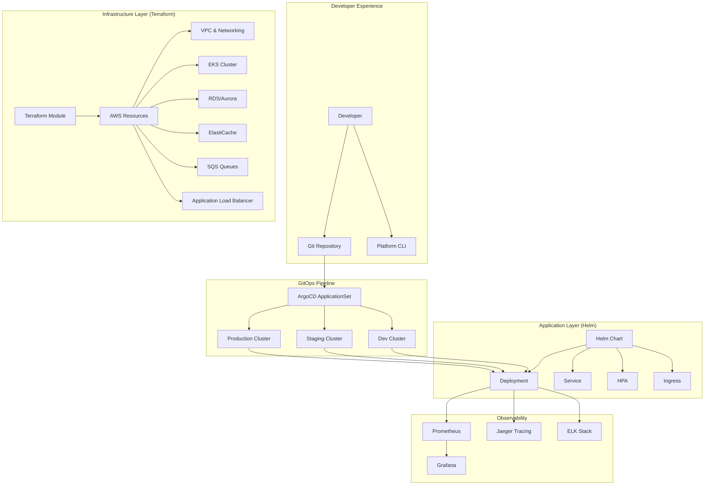
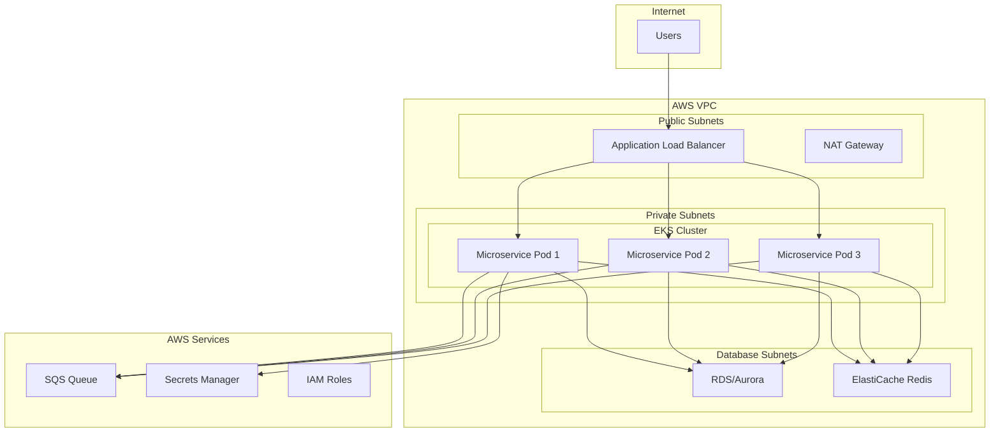
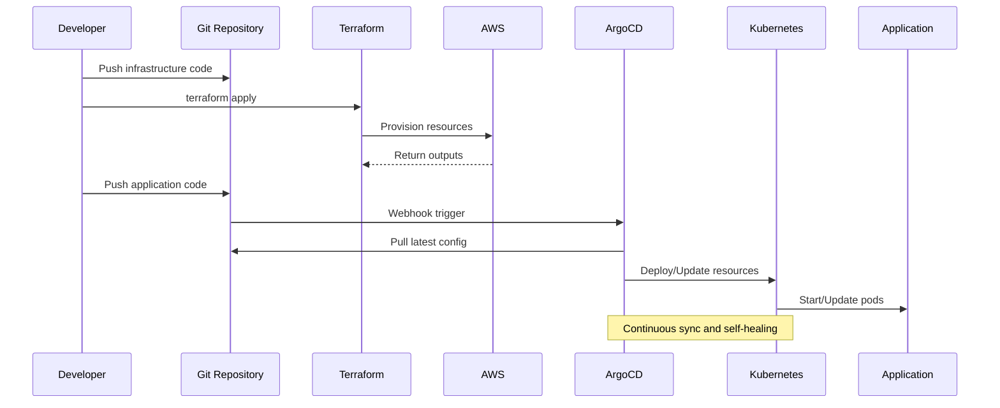
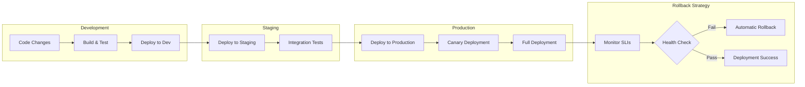
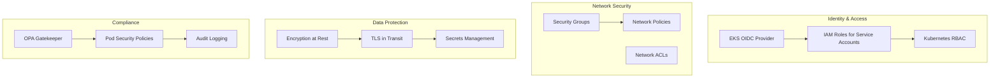

# Architecture Diagram

## High-Level Architecture

```mermaid
graph TB
    subgraph "Developer Experience"
        DEV[Developer] --> GIT[Git Repository]
        DEV --> CLI[Platform CLI]
    end

    subgraph "GitOps Pipeline"
        GIT --> ARGO[ArgoCD ApplicationSet]
        ARGO --> K8S_DEV[Dev Cluster]
        ARGO --> K8S_STAGE[Staging Cluster]
        ARGO --> K8S_PROD[Production Cluster]
    end

    subgraph "Infrastructure Layer (Terraform)"
        TF[Terraform Module] --> AWS[AWS Resources]
        AWS --> VPC[VPC & Networking]
        AWS --> EKS[EKS Cluster]
        AWS --> RDS[RDS/Aurora]
        AWS --> CACHE[ElastiCache]
        AWS --> SQS[SQS Queues]
        AWS --> ALB[Application Load Balancer]
    end

    subgraph "Application Layer (Helm)"
        HELM[Helm Chart] --> DEPLOY[Deployment]
        HELM --> SVC[Service]
        HELM --> HPA[HPA]
        HELM --> INGRESS[Ingress]
    end

    subgraph "Observability"
        PROM[Prometheus] --> GRAF[Grafana]
        JAEGER[Jaeger Tracing]
        ELK[ELK Stack]
    end

    K8S_DEV --> DEPLOY
    K8S_STAGE --> DEPLOY
    K8S_PROD --> DEPLOY
    
    DEPLOY --> PROM
    DEPLOY --> JAEGER
    DEPLOY --> ELK
```

## Network Architecture

```mermaid
graph TB
    subgraph "Internet"
        USER[Users]
    end

    subgraph "AWS VPC"
        subgraph "Public Subnets"
            ALB[Application Load Balancer]
            NAT[NAT Gateway]
        end

        subgraph "Private Subnets"
            subgraph "EKS Cluster"
                POD1[Microservice Pod 1]
                POD2[Microservice Pod 2]
                POD3[Microservice Pod 3]
            end
        end

        subgraph "Database Subnets"
            RDS[RDS/Aurora]
            CACHE[ElastiCache Redis]
        end
    end

    subgraph "AWS Services"
        SQS[SQS Queue]
        SECRETS[Secrets Manager]
        IAM[IAM Roles]
    end

    USER --> ALB
    ALB --> POD1
    ALB --> POD2
    ALB --> POD3
    
    POD1 --> RDS
    POD1 --> CACHE
    POD1 --> SQS
    POD1 --> SECRETS
    
    POD2 --> RDS
    POD2 --> CACHE
    POD2 --> SQS
    
    POD3 --> RDS
    POD3 --> CACHE
    POD3 --> SQS
```

## Deployment Flow

```mermaid
sequenceDiagram
    participant Dev as Developer
    participant Git as Git Repository
    participant TF as Terraform
    participant AWS as AWS
    participant ArgoCD as ArgoCD
    participant K8s as Kubernetes
    participant App as Application

    Dev->>Git: Push infrastructure code
    Dev->>TF: terraform apply
    TF->>AWS: Provision resources
    AWS-->>TF: Return outputs
    
    Dev->>Git: Push application code
    Git->>ArgoCD: Webhook trigger
    ArgoCD->>Git: Pull latest config
    ArgoCD->>K8s: Deploy/Update resources
    K8s->>App: Start/Update pods
    
    Note over ArgoCD,K8s: Continuous sync and self-healing
```

## Multi-Environment Strategy

```mermaid
graph LR
    subgraph "Development"
        DEV_CODE[Code Changes] --> DEV_BUILD[Build & Test]
        DEV_BUILD --> DEV_DEPLOY[Deploy to Dev]
    end

    subgraph "Staging"
        DEV_DEPLOY --> STAGE_DEPLOY[Deploy to Staging]
        STAGE_DEPLOY --> STAGE_TEST[Integration Tests]
    end

    subgraph "Production"
        STAGE_TEST --> PROD_DEPLOY[Deploy to Production]
        PROD_DEPLOY --> CANARY[Canary Deployment]
        CANARY --> FULL_DEPLOY[Full Deployment]
    end

    subgraph "Rollback Strategy"
        FULL_DEPLOY --> MONITOR[Monitor SLIs]
        MONITOR --> ROLLBACK{Health Check}
        ROLLBACK -->|Fail| REVERT[Automatic Rollback]
        ROLLBACK -->|Pass| SUCCESS[Deployment Success]
    end
```

## Security Architecture

```mermaid
graph TB
    subgraph "Identity & Access"
        OIDC[EKS OIDC Provider]
        IRSA[IAM Roles for Service Accounts]
        RBAC[Kubernetes RBAC]
    end

    subgraph "Network Security"
        SG[Security Groups]
        NACL[Network ACLs]
        NP[Network Policies]
    end

    subgraph "Data Protection"
        ENCRYPT[Encryption at Rest]
        TLS[TLS in Transit]
        SECRETS[Secrets Management]
    end

    subgraph "Compliance"
        OPA[OPA Gatekeeper]
        PSP[Pod Security Policies]
        AUDIT[Audit Logging]
    end

    OIDC --> IRSA
    IRSA --> RBAC
    SG --> NP
    ENCRYPT --> TLS
    TLS --> SECRETS
    OPA --> PSP
    PSP --> AUDIT
```

## Scaling Architecture

```mermaid
graph TB
    subgraph "Application Scaling"
        HPA[Horizontal Pod Autoscaler]
        VPA[Vertical Pod Autoscaler]
        CA[Cluster Autoscaler]
    end

    subgraph "Database Scaling"
        READ_REPLICA[Read Replicas]
        AURORA_SCALE[Aurora Serverless]
        CONN_POOL[Connection Pooling]
    end

    subgraph "Cache Scaling"
        REDIS_CLUSTER[Redis Cluster Mode]
        CACHE_REPLICA[Cache Replicas]
    end

    subgraph "Load Balancing"
        ALB_SCALE[ALB Auto Scaling]
        CROSS_AZ[Cross-AZ Distribution]
    end

    HPA --> VPA
    VPA --> CA
    READ_REPLICA --> AURORA_SCALE
    AURORA_SCALE --> CONN_POOL
    REDIS_CLUSTER --> CACHE_REPLICA
    ALB_SCALE --> CROSS_AZ
```